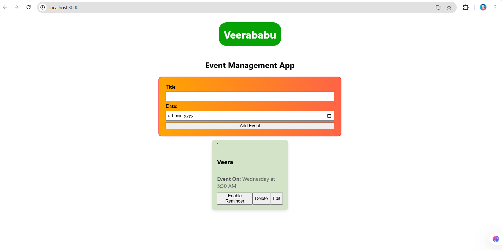

# Userababu - Event Management App 📅


**Veerababu's** is a simple and intuitive event management application designed to help users keep track of their events, set reminders, and manage their schedules efficiently.

---

## 📸 Preview



---

## 🚀 Features

- **Add Events:** Easily add new events with a title, date, and time.
- **Set Reminders:** Enable reminders for events to ensure you never miss an important date.
- **Event Management:** Edit or delete events as needed.
- **User-Friendly Interface:** Clean and intuitive design for seamless navigation.

---

## 🔧 Installation

To get started with **Userababu**, follow these steps:

1. Clone the repository:
   ```bash
   git clone https://github.com/yourusername/your-repo-name.git
